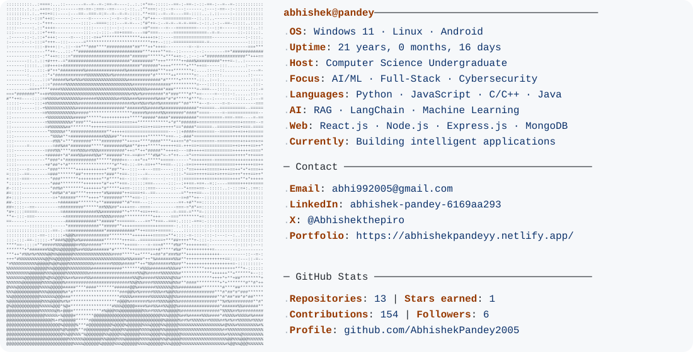

<a href="https://github.com/AbhishekPandey2005">
  <picture>
    <source media="(prefers-color-scheme: dark)" srcset="./dark_mode.svg">
    
  </picture>
</a>

  <a href="https://www.linkedin.com/in/abhishek-pandey-6169aa293/">LinkedIn</a> ·
  <a href="https://x.com/Abhishekthepiro">X</a> ·
  <a href="mailto:abhi992005@gmail.com">Email</a>
  <a href="[https://yourportfolio.com](https://abhishekpandeyy.netlify.app/)">Portfolio</a>

